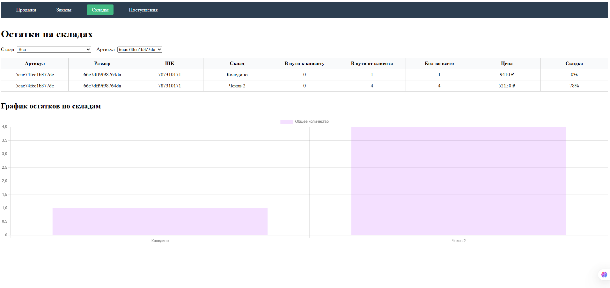

# Wildberries Analytics Dashboard

SPA приложение для анализа данных, построенное на Vue 3 с использованием Composition API.

# Функциональность

Приложение включает 4 основные страницы:

1. Продажи - Анализ продаж по датам, складам и регионам
2. Заказы- Просмотр заказов с возможностью фильтрации
3. Склады - Мониторинг остатков товаров на складах
4. Поступления - Анализ поступающих товаров

На каждой странице реализовано:
- Таблица с данными
- Интерактивные фильтры
- Пагинация
- Визуализация данных (графики)

# Технологии

- Vue 3 (Composition API)
- Vue Router
- Chart.js для визуализации данных
- Vite для сборки

# Скриншоты интерфейса

# Страница заказов

# Страница остатков

